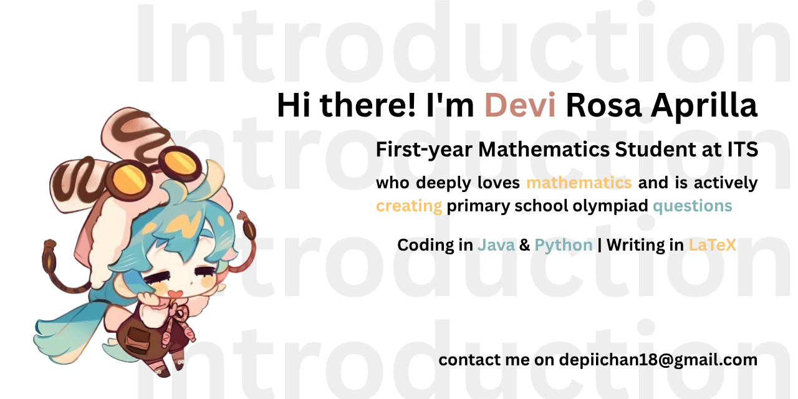

# こんにちは〜！Aku Depichan desu~! 🎀 (≧◡≦)

> 💖 Selamat datang di GitHub profil ku~!  
> Di sini tempatku menyimpan berbagai proyek, tugas kuliah, eksperimen lucuk, dan semua hal yang kuanggap seru~ ✨  
> Semoga kamu betah dan menemukan sesuatu yang bermanfaat dan menyenangkan yaa~ がんばってね！

---

## 📱 Yuk, kontak aku di sini~!

[](https://discord.gg/deraaprill.) 
[](https://instagram.com/devirosaa24) 
[](https://linkedin.com/in/devirosa) 
[](https://medium.com/@Depichan18) 
[](https://quora.com/profile/Depichan18) 
[](https://reddit.com/user/Depichan18) 
[](https://stackoverflow.com/users/30853625) 
[](mailto:depichan18@gmail.com) 

---

## 💻 Bahasa & Tools yang sering kugunakan~（言語とツール）

 
 
 
 
 
 
 
 
 
 
 

[](https://github.com/depichan18/github-readme-stats)

---

## 📚 Akses Soal Evaluasi & Pembahasan（勉強ノートを見たい？）

✨ Mau belajar bareng Depichan? Ikuti cara ini yaa~:

1. **Buka Profil GitHub ku**  
   👉 [`depichan18`](https://github.com/depichan18)

2. **Pilih Repositori yang kamu butuhkan**:
   - [`mata-kuliah-departemen`](https://github.com/depichan18/mata-kuliah-departemen.git)
   - [`mata-kuliah-SKPB`](https://github.com/depichan18/mata-kuliah-SKPB.git)

3. **Cari berdasarkan semester dan mata kuliah**  
   > 📘 Semester 1, 2, dst…  
   > 📌 Ada Kuis 1, ETS, EAS, dan lainnya!

4. **Klik file PDF untuk melihat atau download langsung~**

がんばってね！📖✍️✨

---

## 💾 Cara Menyimpan Soal ke Laptop Kamu~（ローカルに保存する方法）

### 🛠️ Tools yang perlu disiapkan:

1. **VS Code (おすすめ!)**  
   📎 [Download di sini](https://code.visualstudio.com/)

2. **Git (大事だよ！)**  
   📎 [Download Git](https://git-scm.com/downloads)

3. **Clone repositori dengan perintah ini**:
```bash
git clone https://github.com/depichan18/mata-kuliah-departemen.git
```

✨ Tinggal buka di VS Code dan tadaa~ semua file ada di komputermu!

🧸 Tips Tambahan dari Depichan~:
- 📄 Untuk baca PDF di VS Code, install [vscode-pdf](https://marketplace.visualstudio.com/items?itemName=tomoki1207.pdf).
- 📐 Untuk LaTeX file, install  [LaTeX](https://tug.org/texlive/acquire-netinstall.html) dan ekstensi [LaTeX Workshop](https://marketplace.visualstudio.com/items?itemName=James-Yu.latex-workshop) di VS Code.

🌷 Terima kasih sudah mampir yaa~!
Jangan lupa istirahat, minum teh hangat 🍵, dan terus semangat belajarnya!
またね〜！(*≧ω≦)ﾉﾞ

---
